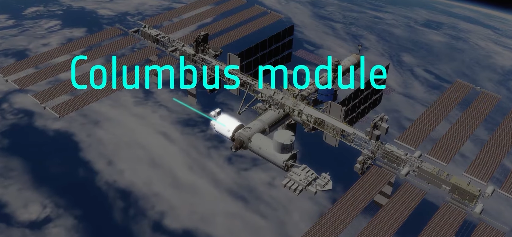
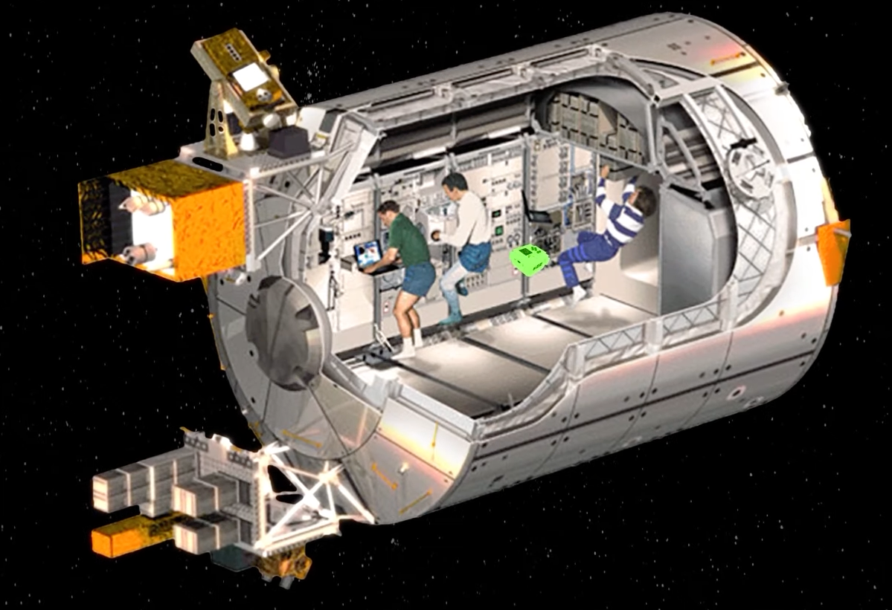
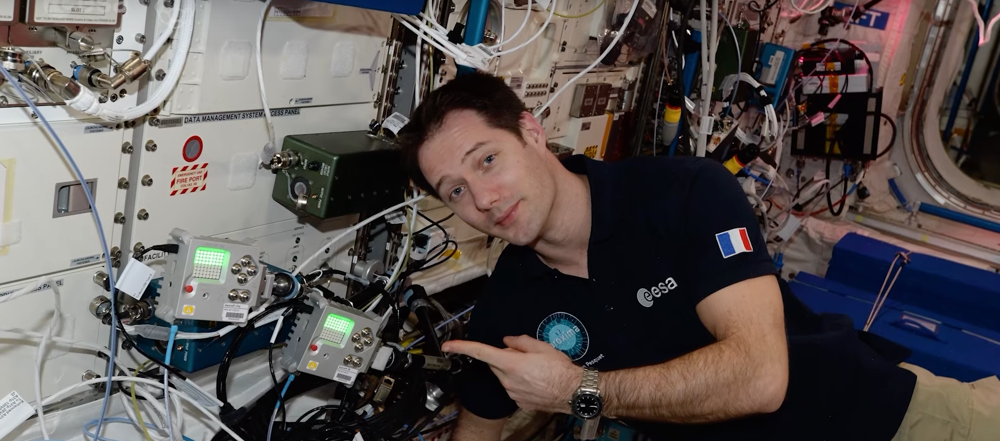

# Catalogue of images for machine learning algorithm

We need to store the images about ISS team and instruments that Astro PI can take with its camera. We want machine learning model to recognize the ISS team, the instruments that the team can move in the ISS or the Astro PI can take around itself.

## Images

We can visit the ISS by [Google Earth](https://earth.google.com/web/). So we can take piture of the [Columbus module](https://en.wikipedia.org/wiki/Columbus_(ISS_module)) to know which permanent instruments the Astro PI can take with its camera.

In the [Mission Space Lab](https://astro-pi.org/mission-space-lab/) official web page, there is a [video](https://youtu.be/owcZeUnSixM) for planning the experiment where we can see

* a possible Astro PI location in the Columbus module,

* and a real Astro PI location with the Astronaut [Thomas Pesquet](https://en.wikipedia.org/wiki/Thomas_Pesquet),

## Mission of this project step

Our goal is to take pictures and to catalogue them with what there is in.

* each picture has to have one object, and the name of picture is the object name
* machine learning model will learn to recognize objects with these pictures
* when Astro PI will take a picture, the machine learning model will recognize the objects
* we cannot save pictures, so we will store objects observed over time
